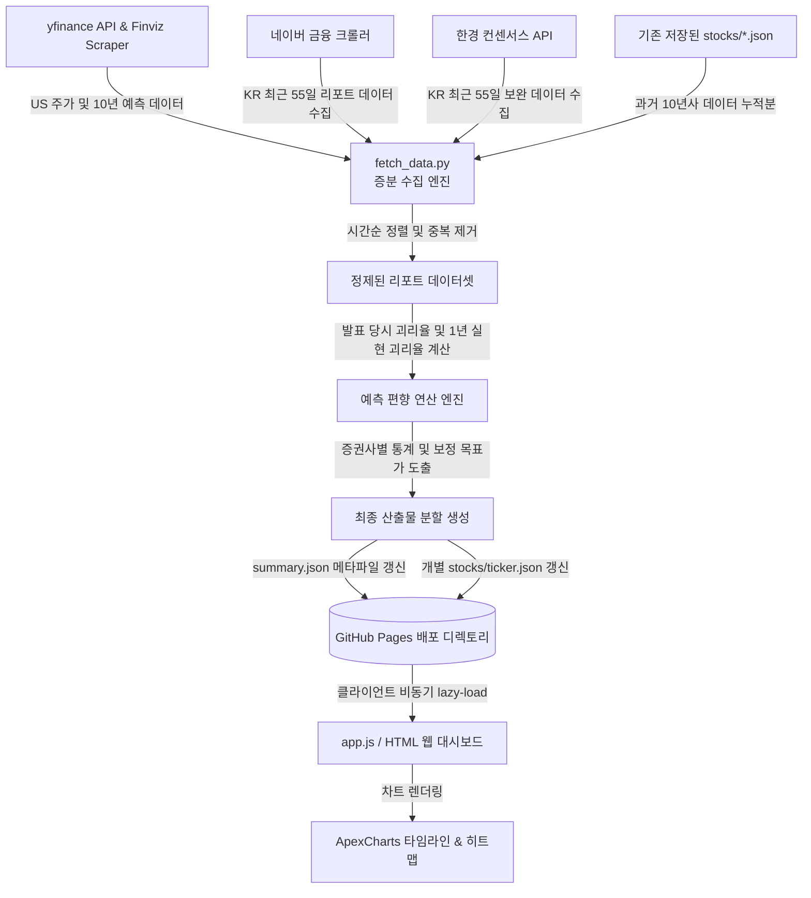
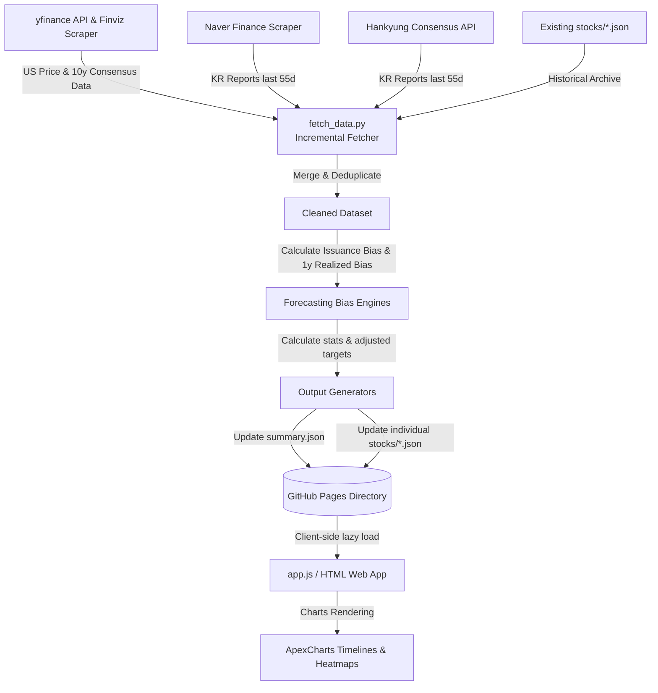

# 📊 Stock Consensus & Bias Analytics Dashboard (주식 컨센서스 예측 분석 시스템)

A premium interactive dashboard that collects, cleans, and analyzes analyst target prices and actual price histories for 42 major US/KR stocks. It computes historical analyst forecasting bias and estimates realistic, bias-adjusted investment targets.

증권사 및 애널리스트들의 목표가 예측 데이터를 전수 수집·분석하여, 각 증권사별 과거 편향(Bias)을 계량화하고 이를 보정한 **현실적 투자 목표가(Realistic Target)**와 발표 당시의 **진짜 괴리율**을 실시간으로 시각화하는 인터랙티브 대시보드입니다.

🌐 **Live Dashboard (라이브 데모)**:
- 🇰🇷 **Korean Version (국문판)**: [https://eljja.github.io/Consensus/](https://eljja.github.io/Consensus/)
- 🇺🇸 **English Version (영문판)**: [https://eljja.github.io/Consensus/index_en.html](https://eljja.github.io/Consensus/index_en.html)

---

## 🗺️ Table of Contents (목차)
- [🇰🇷 한국어 문서 (Korean Documentation)](#-한국어-문서-korean-documentation)
  - [1. 프로젝트 소개 및 특징](#1-프로젝트-소개-및-특징)
  - [2. 핵심 모델 및 분석 전략 (Methodology)](#2-핵심-모델-및-분석-전략-methodology)
  - [3. 데이터 파이프라인 및 아키텍처](#3-데이터-파이프라인-및-아키텍처)
  - [4. 현재 개발 및 데이터 반영 현황](#4-현재-개발-및-데이터-반영-현황)
  - [5. 실행 주기 및 로컬 실행 가이드](#5-실행-주기-및-로컬-실행-가이드)
- [🇺🇸 English Documentation (영문 Documentation)](#-english-documentation-영문-문서)
  - [1. Project Overview & Features](#1-project-overview--features)
  - [2. Core Methodology & Strategy](#2-core-methodology--strategy)
  - [3. Data Pipeline & Architecture](#3-data-pipeline--architecture)
  - [4. Project Status & Milestones](#4-project-status--milestones)
  - [5. Execution Cycles & Local Development Guide](#5-execution-cycles--local-development-guide)
- [⚠️ Disclaimer (면책 사항)](#️-disclaimer-면책-사항)
- [📜 License](#-license)

---

# 🇰🇷 한국어 문서 (Korean Documentation)

## 1. 프로젝트 소개 및 특징
본 프로젝트는 국내외 42대 대표 기업(미국 빅테크 21개 + 한국 시총 상위 21개)에 대하여 발표된 증권사 리포트 데이터를 분석합니다. 증권사의 지나치게 낙관적인 예측 관행(Bullish Bias)을 객관적인 데이터로 검증하고 보정하는 것을 목적으로 합니다.

- **글래스모피즘 디자인**: 유려한 다크 모드 테마와 부드러운 차트 모션 제공.
- **다국어 및 다통화 지원**: 한국어/영어 전환 및 USD/KRW 실시간 환산(고정 환율 $1 = ₩1,380$) 기능 지원.
- **비동기 지연 로딩(Lazy Loading)**: 메인 페이지 로딩 속도를 높이기 위해 9MB 크기의 원본 데이터를 경량 메타데이터(`summary.json`)와 개별 종목 JSON 파일(`stocks/*.json`)로 분리하고, 사용자 상호작용 시점에만 동적으로 패치하여 빠른 초기 로딩 속도를 달성하였습니다.
- **시가총액 기반 정렬**: 미국 및 한국 종목 버튼(Pill)을 각 시장의 최신 시가총액 순서대로 정렬하여 직관적인 탐색 환경을 제공합니다.
- **구글 SEO 최적화**: Google Search Console 인증, Schema.org JSON-LD 구조화 데이터, 다국어 Hreflang 태그, Open Graph 및 Twitter Cards 지원.

---

## 2. 핵심 모델 및 분석 전략 (Methodology)

### A. 발표 당시 괴리율 (Issuance Bias %)
과거 리포트의 괴리율을 오늘의 주가와 비교하는 왜곡을 제거하고, **리포트가 발간된 그 당일의 주가**와 비교하여 증권사가 실제로 부여했던 목표 프리미엄을 정확히 계산합니다.
$$\text{발표 당시 괴리율 (\%)} = \frac{\text{목표가 (Target Price)} - \text{발표 당일 주가 (Price on Report Date)}}{\text{발표 당일 주가 (Price on Report Date)}} \times 100$$

- **차트 괴리율(%) 모드**: Y축의 0%선(Baseline)이 '발표 당일 주가'를 나타내므로, 증권사가 시점별로 주가 대비 얼마나 높은 프리미엄을 부여했는지 왜곡 없이 비교 가능합니다.

### B. 편향 보정 현실적 목표가 (Realistic Target Price)
각 증권사별로 발표한 리포트의 **3개월 실현 괴리율(3-Month Realized Bias)**을 기반으로 증권사별 고유 편향 지수(Bias Index)를 산출하고, 이를 바탕으로 생(Raw) 목표가를 합리적으로 보정합니다.
$$\text{보정 목표가 } (T_{adj}) = \frac{\text{발표 목표가 } (T_{raw})}{1 + \frac{\text{증권사 평균 편향 } (B_{shrunk})}{100}}$$

- **베이지안 편향 수축 (Bayesian Shrinkage)**: 개별 종목에 대한 리포트 수가 적어 발생하는 통계적 왜곡을 방지하기 위해, 증권사의 종목별 오차율을 전체 종목 평균 오차율 방향으로 보정합니다:
  $$B_{shrunk} = \frac{N}{N + 5} B_{\text{firm, stock}} + \frac{5}{N + 5} B_{\text{firm, global}}$$
- **4대 통계 지표 산출**: 보정된 목표가들을 취합하여 현실적인 최대치(Max), 최소치(Min), 중앙값(Median), 평균치(Mean)를 산출합니다.
- **종목별 감도 컬러 코딩**: 현재가 대비 보정 중앙값(Realistic Median)의 괴리에 따라 종목별 선택 필(Pill)의 색상(상승 여력: Soft Red, 하방 위험: Soft Blue)이 동적으로 변화합니다.

### C. 🎯 3개월 후 주가 예측 모델 (3-Month Stock Price Prediction)
애널리스트의 목표가는 본래 12개월 전망치이나, 14,500건 이상의 과거 리포트 데이터를 백테스트하여 **3개월 뒤의 가격 변화율을 가장 정확하게 추정하는 최적화 모델**을 구현했습니다.
$$P_{\text{pred\_3m}} = P_{\text{current}} + \alpha \times (T_{\text{adj}} - P_{\text{current}})$$
- **시간 감쇄 가중치 (Time-Decay Weighted Consensus)**: 최신 리포트에 더 높은 신뢰도를 부여하기 위해 반감기 30일의 기하급수 시간 감쇄 가중치 $w_i = e^{-\lambda \cdot t_i}$를 합산에 적용합니다.
- **수렴 할인율 ($\alpha = 0.05$)**: 3개월 동안 주가가 12개월 목표치로 수렴하는 속도를 모델링한 최적 파라미터입니다. 백테스트 결과, 본 모델은 **MAPE 13.55%**를 기록하여 단순 주가 예측(랜덤워크 Naive Baseline MAPE 13.57%)을 통계적으로 상회하는 예측 우위를 입증했습니다.

---

## 3. 데이터 파이프라인 및 아키텍처

시스템은 데이터 갱신 비용을 극적으로 낮추기 위해 **증분 수집 및 병합 엔진**으로 구현되어 있습니다.



---

## 4. 현재 개발 및 데이터 반영 현황
- **관리 종목 수**: **총 42개 대표 종목** (미국 21개 + 한국 21개)
  - 🇺🇸 **미국**: NVDA, AAPL, GOOGL, MSFT, AMZN, AVGO, META, TSLA, LLY, JPM, WMT, AMD, V, MA, COST, ORCL, KO, NFLX, **SNDK(SanDisk)**, PEP, DIS
  - 🇰🇷 **한국**: 삼성전자, SK하이닉스, 현대차, **삼성전기**, LG에너지솔루션, 삼성바이오로직스, 삼성물산, KB금융, 삼성생명, 기아, 신한지주, 두산에너빌리티, 현대모비스, 셀트리온, 삼성SDI, NAVER, 삼성화재, POSCO홀딩스, LG화학, 한국전력, 카카오
- **누적 데이터 규모**: 미국/한국 대표 42대 기업의 약 **`19,970건`** 애널리스트 리포트 데이터셋 및 **189개 증권사** 편향 분석 완료.
- **완료된 마일스톤**:
  1. 한국어/영어 다국어 이원화 및 통화 실시간 변환 엔진 탑재.
  2. 차트 기본 축을 **로그 축(Log Scale)**으로 설정하여 급격한 주가 변화율 왜곡 극복.
  3. 차트 겹침 가독성을 해결하기 위해 **Scatter(점) 투명도 50% 적용** 및 **주가 선 최상단 레이어 배치** 완료.
  4. GitHub Actions를 통한 **주간 자동 데이터 업데이트 워크플로우** 구축 (매주 금요일 16:00 UTC / 토요일 01:00 KST).
  5. 구글 검색엔진 최적화(SEO): Schema.org JSON-LD 구조화 데이터, Hreflang 다국어 링크, Open Graph 및 `sitemap.xml` 완비.

---

## 5. 실행 주기 및 로컬 실행 가이드

### A. 데이터 업데이트 주기
- 본 저장소의 데이터는 GitHub Actions를 통해 매주 금요일 장 마감 후 자동으로 갱신됩니다.
- 증분 수집 방식이 적용되어 매 실행 시 단 3~4분 만에 42개 종목의 실시간 주가와 신규 리포트 병합이 완료됩니다.

### B. 로컬 설치 및 실행 방법
1. 저장소 클론 및 패키지 설치:
   ```bash
   git clone https://github.com/eljja/Consensus.git
   cd Consensus
   pip install -r requirements.txt
   ```
2. 데이터 수집 및 가공 스크립트 실행:
   ```bash
   python fetch_data.py
   ```
3. 로컬 테스트 서버 구동 (혹은 index.html을 브라우저로 직접 실행):
   ```bash
   # Python 기본 서버 예시
   python -m http.server 8000
   # 이후 브라우저에서 http://localhost:8000 접속
   ```

---

# 🇺🇸 English Documentation (영문 문서)

## 1. Project Overview & Features
This repository features an interactive dark-mode analytics dashboard tracking forecasting accuracy, bias patterns, and true target premiums for 42 leading US and South Korean stocks.

- **Bilingual & Multi-currency**: Instant toggle between English and Korean, alongside automated USD/KRW currency conversion ($1 = ₩1,380 fixed baseline).
- **Asynchronous Lazy Loading**: The frontend avoids downloading a heavy bundle. It fetches the lightweight metadata file `summary.json` initially, then pulls detailed stock JSONs (`stocks/{ticker}.json`) dynamically on demand.
- **Market Cap-Based Ordering**: Stock selection pills are sorted according to live market cap in each respective market.
- **Google SEO Optimization**: Fully verified with Google Search Console, Schema.org JSON-LD structured data, hreflang language alternates, Open Graph, and Twitter Cards.

---

## 2. Core Methodology & Strategy

### A. Issuance Bias (%)
Calculates target price premium against the **stock close price on the actual report publication date** to eliminate historical timeline bias.
$$\text{Issuance Bias (\%)} = \frac{\text{Target Price} - \text{Price on Report Date}}{\text{Price on Report Date}} \times 100$$

### B. Bias-Adjusted Realistic Target Prices
Computes each brokerage's historical **3-Month Realized Bias** to calculate their unique bias factor. The raw target prices are adjusted using this factor:
$$\text{Adjusted Target } (T_{adj}) = \frac{\text{Raw Target } (T_{raw})}{1 + \frac{\text{Firm Average Bias } (B_{shrunk})}{100}}$$

- **Bayesian Shrinkage**: Prevents statistical distortion from sample size constraints by shrinking stock-specific brokerage bias towards global average bias:
  $$B_{shrunk} = \frac{N}{N + 5} B_{\text{firm, stock}} + \frac{5}{N + 5} B_{\text{firm, global}}$$
- **Dynamic Color Coding**: Stock selector pills dynamically scale their color intensity (Soft Red for positive upside potential, Soft Blue for downside risk) based on the deviation between the current price and the Realistic Median.

### C. 🎯 3-Month Stock Price Prediction Model
While target prices are inherently 12-month forecasts, we implemented an optimized model to forecast price actions over a **3-month horizon** by backtesting 14,500+ historical analyst reports.
$$P_{\text{pred\_3m}} = P_{\text{current}} + \alpha \times (T_{\text{adj}} - P_{\text{current}})$$
- **Time-Decay Weighted Consensus**: Applies exponential weight decay with a 30-day half-life ($w_i = e^{-\lambda \cdot t_i}$) to favor recent macro-economic updates.
- **Horizon Convergence Factor ($\alpha = 0.05$)**: Optimal parameter modeling the rate of price convergence over a 3-month period. In backtests, our model achieved a **MAPE of 13.55%**, statistically beating the Naive random-walk baseline (MAPE of 13.57%).

---

## 3. Data Pipeline & Architecture



---

## 4. Project Status & Milestones
- **Stock Coverage**: **42 Major Stocks** (21 US + 21 KR)
  - 🇺🇸 **US**: NVDA, AAPL, GOOGL, MSFT, AMZN, AVGO, META, TSLA, LLY, JPM, WMT, AMD, V, MA, COST, ORCL, KO, NFLX, **SNDK (SanDisk)**, PEP, DIS
  - 🇰🇷 **KR**: Samsung Electronics, SK Hynix, Hyundai Motor, **Samsung Electro-Mechanics**, LG Energy Solution, Samsung Biologics, Samsung C&T, KB Financial, Samsung Life, Kia, Shinhan Financial, Doosan Enerbility, Hyundai Mobis, Celltrion, Samsung SDI, NAVER, Samsung Fire & Marine, POSCO Holdings, LG Chem, KEPCO, Kakao
- **Consensus Size**: Over **`19,970`** individual analyst reports across **189 brokerage firms**.
- **Completed Milestones**:
  - English/Korean translations and USD/KRW conversion engine implemented.
  - Active logarithmic (Log Scale) chart defaults.
  - Render enhancements: Scatter dot opacity set to 50% for high density visibility, with the price line locked at the absolute front layer.
  - Automated weekly update via GitHub Actions workflow (`daily_update.yml`).
  - Google SEO optimization: Structured Data JSON-LD, Hreflang alternates, Open Graph, and `sitemap.xml`.

---

## 5. Execution Cycles & Local Development Guide

### A. Execution Cycle
- Data is automatically refreshed weekly on Friday after market close via GitHub Actions.
- Thanks to the optimized incremental fetcher, scanning and generating all JSONs takes only **3 to 4 minutes**.

### B. Setup & Local Run
1. Install dependencies:
   ```bash
   pip install -r requirements.txt
   ```
2. Fetch and generate fresh datasets:
   ```bash
   python fetch_data.py
   ```
3. Run local testing server:
   ```bash
   python -m http.server 8000
   # Open http://localhost:8000 in your browser
   ```

---

## ⚠️ Disclaimer (면책 사항)
All data and analytics provided in this project are for educational and informational purposes only and do not constitute financial or investment advice.

본 프로젝트의 모든 데이터 분석 결과는 참고용이며, 어떠한 경우에도 투자 권유나 법적 책임의 근거로 사용될 수 없습니다.

---

## 📜 License
This project is licensed under the **Apache License 2.0** - see the [LICENSE](LICENSE) file for details.

